
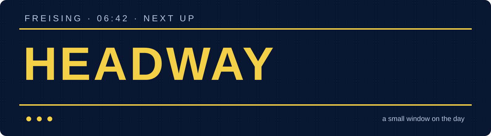

<strong>Train and bus departures, the last few hours at the station, and the weather before I leave home.</strong>

<a href="docs/index.html">Mobile site source (Pages-ready)</a> · <a href="docs/FEATURE_GUIDE.md">Screen and icon guide</a> · <a href="enclosure/README.md">Enclosures</a> · <a href="https://github.com/haldarsaurav/Headway_code">Firmware and tests</a>

## Why I built Headway

I live near Freising and kept checking departures on my phone just before going out. I wanted the answer to be there at a glance: what leaves next, whether trains have been running late for the past few hours, and whether I should take a jacket or expect rain. The idea is to put Model A beside my bathroom mirror or near the front door, where I can see it while I brush my teeth and start the day. Model B sits on my desk.

It is a 3.2-inch ILI9341 screen driven by an ESP32-C3 Super Mini. One tap on the board's BOOT button moves to the next page. A three-second hold opens setup. The board reads transport data through [Transitous](https://transitous.org/) and weather from [Open-Meteo](https://open-meteo.com/); it is an independent personal build, not an official operator display.

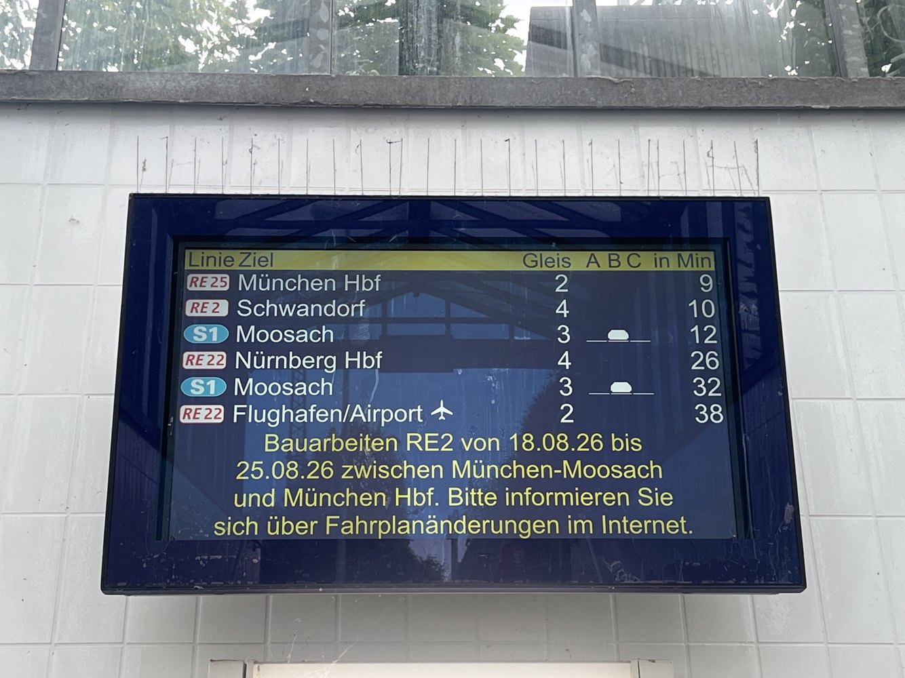 A sign I saw at Freising station. This is a reference photo, not a photo of the finished device.

## Take a look

The [project page](docs/index.html) lets you switch **five looks** and the train, bus, weather, outlook and device-setup screens. Its preview images were rendered from the actual drawing code with sample data, not photographed from hardware. The images are from firmware 1.2.6; 1.2.7 changed the delay-history restart behaviour and boot version, not the other page drawings.

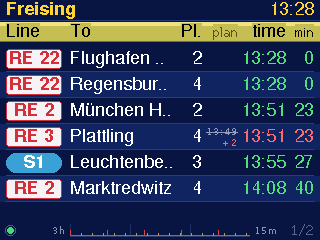 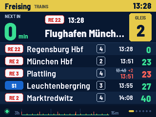 Original and Bahnsteig, using the same sample departures.

Original — the first platform-sign layout

 Original · train board · sample data

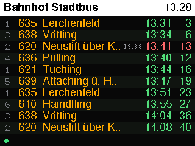 Original · town bus · sample data

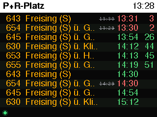 Original · P+R bus · sample data

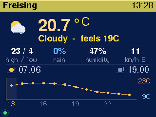 Original · weather now · sample data

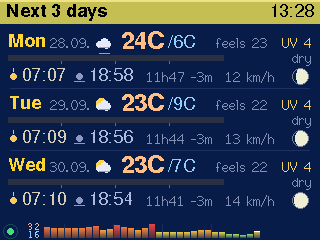 Original · three-day outlook · sample data

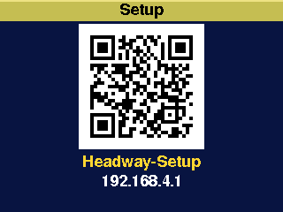 Original · device setup · sample data

Bahnsteig — navy and signal yellow

 Bahnsteig · train board · sample data

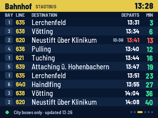 Bahnsteig · town bus · sample data

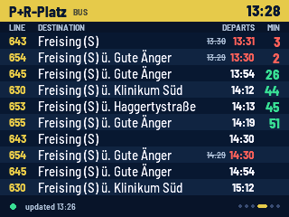 Bahnsteig · P+R bus · sample data

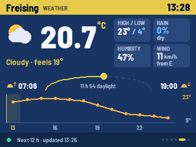 Bahnsteig · weather now · sample data

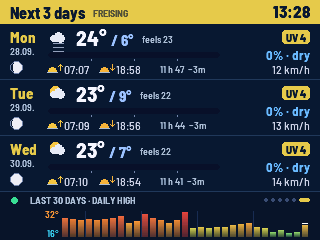 Bahnsteig · three-day outlook · sample data

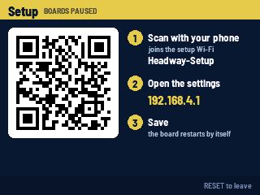 Bahnsteig · device setup · sample data

Amber Matrix — electronic display dots

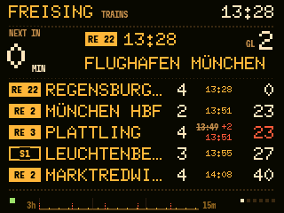 Amber Matrix · train board · sample data

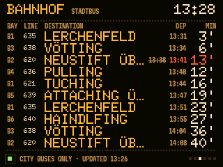 Amber Matrix · town bus · sample data

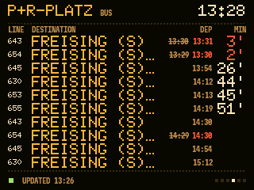 Amber Matrix · P+R bus · sample data

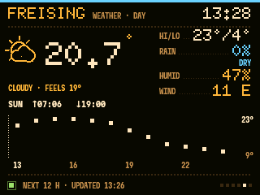 Amber Matrix · weather now · sample data

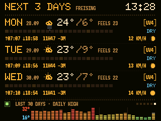 Amber Matrix · three-day outlook · sample data

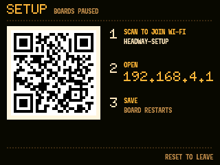 Amber Matrix · device setup · sample data

Papier — light paper and ink

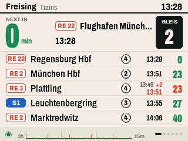 Papier · train board · sample data

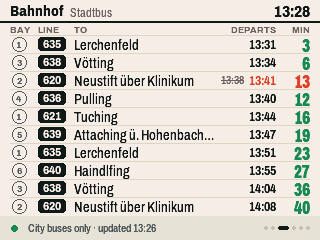 Papier · town bus · sample data

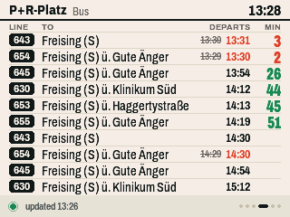 Papier · P+R bus · sample data

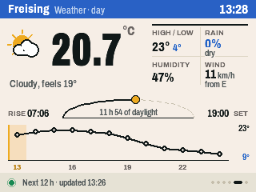 Papier · weather now · sample data

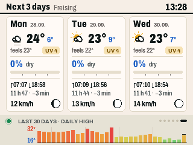 Papier · three-day outlook · sample data

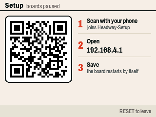 Papier · device setup · sample data

Split-Flap — mechanical tile lettering

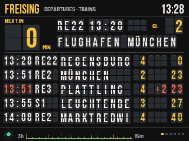 Split-Flap · train board · sample data

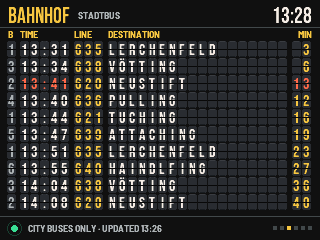 Split-Flap · town bus · sample data

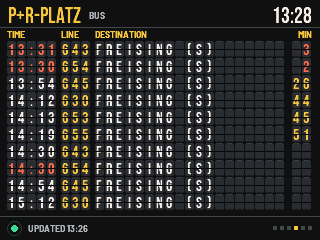 Split-Flap · P+R bus · sample data

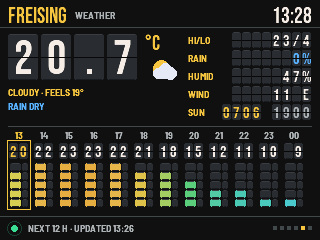 Split-Flap · weather now · sample data

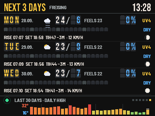 Split-Flap · three-day outlook · sample data

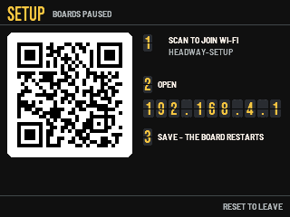 Split-Flap · device setup · sample data

The page order is **trains → Bahnhof Stadtbus → P+R-Platz → weather now → three-day outlook**. Trains can occupy one to four screens depending on the returned services. Automatic page changes and scrolling long destinations are separate, optional settings. The [full guide](docs/FEATURE_GUIDE.md) explains every badge, time, colour, icon, graph mark, status message and control with examples.

### The history strip

The train footer shows 180 elapsed-minute slots. It averages positive reported lateness among comparable realtime departures due within the next hour of each fetched board. Red marks show cancellations separately; grey marks warn of incomplete realtime coverage; gaps mean no usable sample. It is a quick view of recent feed reports, not a station-wide punctuality score. Since firmware 1.2.7 the strip survives a software restart, with a gap for the restart, but loses its history when power is removed. [Read the graph definition](docs/DELAY_GRAPH.md).

## How it works

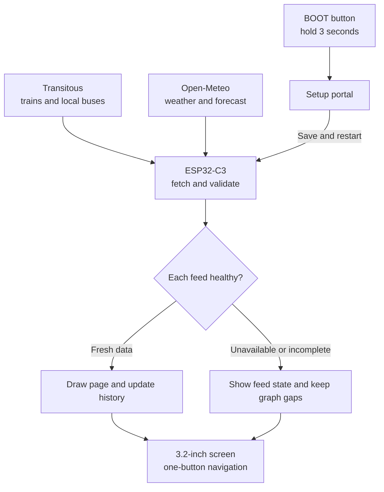

I liked how [CapturedPortal](https://github.com/haKC-ai/CapturedPortal) uses a flowchart to make a project legible, so I drew the Headway data path above.

The feeds have separate health states. A working weather refresh cannot hide a failed train refresh. During an outage, countdowns still advance and expired rows disappear; retained readings may become stale. [Status and remaining hardware checks](docs/PROJECT_STATUS.md).

## First setup, in plain steps

1. Power the board by USB-C. On first use, scan the on-screen QR to join **Headway-Setup**.
2. Scan the settings QR or open **http://192.168.4.1/** on that Wi-Fi network.
3. Choose a 2.4 GHz network, automatic or typed weather town, one of the five looks, and optional page changes and scrolling. Press **Save and restart**.
4. Tap BOOT for the next page; hold it for three seconds to reopen setup. Hold it only after startup, because GPIO 9 is a boot strap pin.

The portal presents its controls in separate cards:

- **Wi-Fi:** choose a scanned 2.4 GHz network or type its name; leaving the password empty keeps the saved one for the same network.
- **Weather place:** detect an approximate location from the connection, or enter a town. The Freising transport stops stay fixed.
- **Look:** Original is the default; the other four choices preview immediately in the portal, then apply to the board after Save.
- **Pages and names:** automatic page changes and destination scrolling are independent and off by default; set the page interval when automatic changes are on.
- **Save and restart:** stores the settings and restarts. The delay graph keeps recent readings across that software restart, leaving a gap while setup was open.
- **Start over:** asks a second time, then forgets Wi-Fi and every setting and empties the history.

The [feature guide](docs/FEATURE_GUIDE.md#boot-controls-and-setup) covers the QR screens, controls and troubleshooting.

## The two cases

**Model A · wall, Rev9.** The slim case is meant for the morning route through the home. **Model B · desk, rev2.** The separate stand tips the screen back 15°; USB-C enters from the right. Both current designs use four M2.5 heat-set inserts and four countersunk screws. Using threaded inserts was a first for me; I wanted a back I could open without wearing out a plastic screw hole. The printed fit and final assembly still need checking.

  Current shell geometry rendered from the FreeCAD exports, not physical-product photos.

Both have [isometric, front, back, top and side views](enclosure/README.md), plus back-plate views and a separate stand view for Model B. The [FreeCAD sources and printable parts](enclosure/README.md) are kept with each model. The two photos below are real case parts on the printer bed under different light, not a completed powered unit.

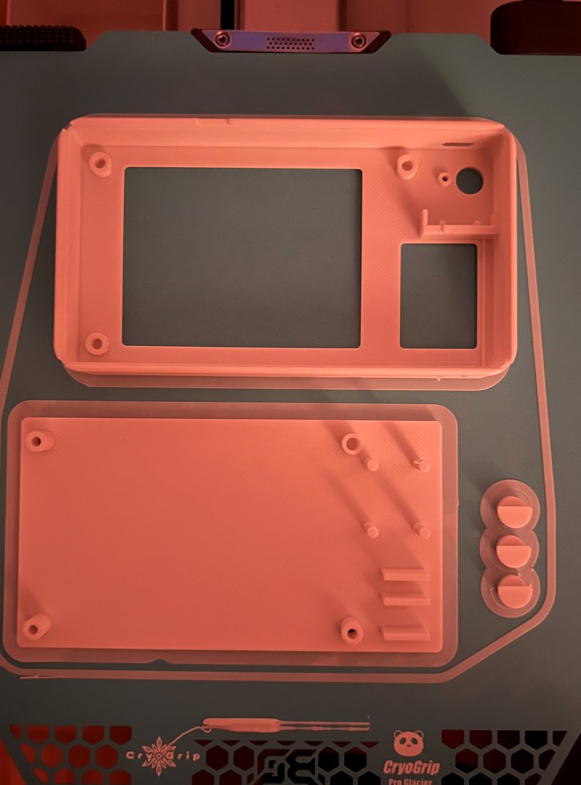 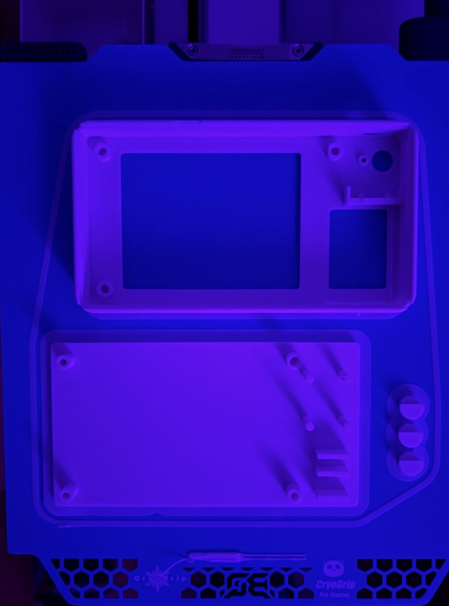

## Wiring and energy

The circuit is two boards and nine wires. The display uses the C3's 3V3, GND, 5V and GPIO 3/4/5/6/7/10; BOOT on GPIO 9 is the control. [Pinout diagram and wiring table](docs/SCHEMATIC.md) · [ESP32-C3 module datasheet](https://documentation.espressif.com/esp32-c3-mini-1_datasheet_en.html) · [MSP3218 display manual and pinout](https://www.lcdwiki.com/res/MSP3218/3.2inch_SPI_Module_MSP3218_User_Manual_EN.pdf). Check the labels on your actual boards before powering them; Super Mini variants differ. The project drawing uses 5 V on the display LED pin, while the MSP3218 manual describes 3.3 V for always-on backlighting, so verify that connection on the exact module.

At an **assumed** average of 0.75 W, 24-hour operation works out to **6.57 kWh/year**. At an example energy price of €0.30/kWh, that is about **€1.97/year** in energy, before any standing charge. The 0.75 W figure is not a documented meter reading for this revision; I still want to check it with a USB power meter.

## Current state and rights

Firmware **1.2.7** is in the [code repository](https://github.com/haldarsaurav/Headway_code), along with tests, preview tooling, build instructions and the changelog. Its PC renders, 52 compile-time logic/graph assertions and nine setup scenarios passed; the new firmware still needs an ESP32 compile, flash and physical display check. The CAD also needs a fit check. See [project status](docs/PROJECT_STATUS.md) for the precise scope.

Copyright 2026 **Saurav Haldar**. This public repository is for viewing the project. Use and reuse require permission under the [licence](LICENSE); the [AI-use policy](AI_POLICY.md) and [permission guide](docs/PERMISSIONS.md) explain the request process. Third-party transport, weather and font material retains its own terms.
