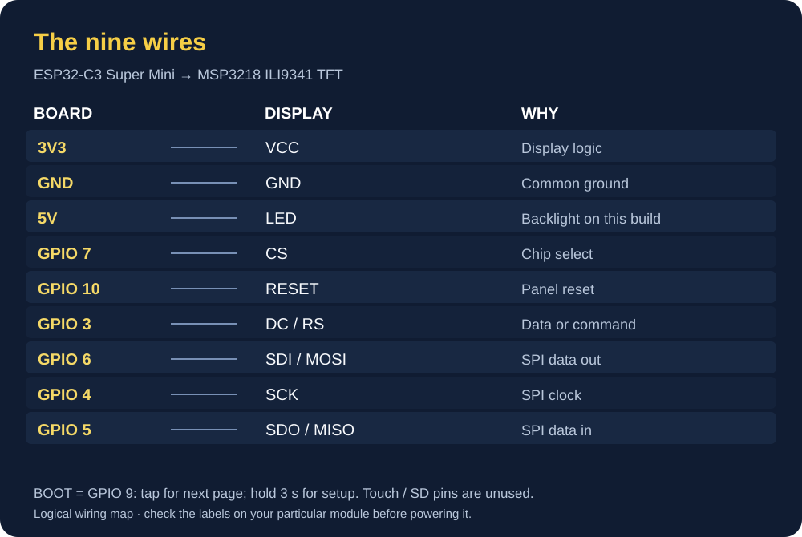

# Wiring and pinout

Headway Rev1.2 / firmware v1.2.8 — the whole circuit is two boards and nine wires.
No resistors, no level shifters, no extra button: MODE is the BOOT button already on the ESP32-C3.

<p align="center"><br><sub>Logical wiring map for this build; check the labels on the boards in your hands.</sub></p>

The [Espressif ESP32-C3 module datasheet](https://documentation.espressif.com/esp32-c3-mini-1_datasheet_en.html) covers GPIO and boot behaviour. The [MSP3218 user manual](https://www.lcdwiki.com/res/MSP3218/3.2inch_SPI_Module_MSP3218_User_Manual_EN.pdf) gives the display connector pinout; its [product page](https://www.lcdwiki.com/3.2inch_SPI_Module_ILI9341_SKU:MSP3218) links further display documents. Super Mini carrier boards can differ, so these sources supplement rather than replace the actual silkscreen.

```
                         USB-C  (5 V power + serial + flashing)
                           ║
        ┌──────────────────╨──────────────────┐
        │         ESP32-C3  SUPER MINI        │
        │                                     │
        │  3V3  ●─────────────────────────────┼──────────●  VCC          ┐
        │  GND  ●─────────────────────────────┼──────────●  GND          │
        │  5V   ●─────────────────────────────┼──────────●  LED          │  (backlight)
        │                                     │                          │
        │  GPIO 7   ●── CS ───────────────────┼──────────●  CS           │  3.2"  SPI TFT
        │  GPIO 10  ●── RESET ────────────────┼──────────●  RESET        │  ILI9341
        │  GPIO 3   ●── DC / RS ──────────────┼──────────●  DC / RS      │  240 x 320
        │  GPIO 6   ●── MOSI (SPI2) ──────────┼──────────●  SDI / MOSI   │  (landscape
        │  GPIO 4   ●── SCK  (SPI2) ──────────┼──────────●  SCK          │   320 x 240)
        │  GPIO 5   ●── MISO (SPI2) ──────────┼──────────●  SDO / MISO   │
        │                                     │                          │
        │  GPIO 9   ●── [BOOT] ── GND         │           T_CLK  ┐       │
        │           (= MODE button,           │           T_CS   │       │
        │            internal pull-up)        │           T_DIN  │ not   │
        │                                     │           T_DO   │ con-  │
        │  [RST]  hardware reset              │           T_IRQ  │ nected│
        │                                     │           SD_*   ┘       ┘
        └─────────────────────────────────────┘
```

## Pin table

| TFT pin | ESP32-C3 | Signal | Notes |
|---|---|---|---|
| VCC | **3V3** | logic supply | ⚠️ must be 3.3 V — on 5 V the panel lights but stays **white** |
| GND | GND | ground | |
| CS | GPIO 7 | SPI chip select | |
| RESET | GPIO 10 | panel reset | |
| DC / RS | GPIO 3 | data / command | |
| SDI / MOSI | GPIO 6 | SPI data out | SPI2 host |
| SCK | GPIO 4 | SPI clock | 20 MHz write, 8 MHz read |
| SDO / MISO | GPIO 5 | SPI data in | lets LovyanGFX read the panel back |
| LED | 5V | backlight | always on; biggest single power draw |
| T_* / SD_* | — | touch + SD card | not used |

**Backlight check:** this project's wiring plan puts the module's `LED` pin on the board's 5 V rail. The [MSP3218 manual](https://www.lcdwiki.com/res/MSP3218/3.2inch_SPI_Module_MSP3218_User_Manual_EN.pdf) describes 3.3 V for an always-on backlight. Confirm the exact module's backlight circuit and rating before copying the 5 V connection; the published diagram records this build's wiring, not a universal module recommendation.

| On the ESP32 board | GPIO | Used as |
|---|---|---|
| BOOT button | 9 | **MODE** — tap = next page, hold 3 s = setup |
| RST button | — | restart (hardware) |

## Power

```
USB 5 V ──┬── ESP32-C3 on-board 3.3 V regulator ──► ESP32-C3 + TFT VCC (logic)
          └──────────────────────────────────────► TFT LED (backlight)
```

- Power it from a decent USB supply or a PC port. The Wi-Fi TX burst on top of the backlight
  can dip the rail on a weak cable/breadboard — the board then logs **"brown-out (power dip)"**
  as its last restart reason (shown in red on the boot splash and on the setup page).
- GPIO 9 is a **strapping pin**: holding BOOT *while plugging in or pressing RST* puts the chip
  into flash-download mode (dark screen). Press MODE only after the splash is up.
