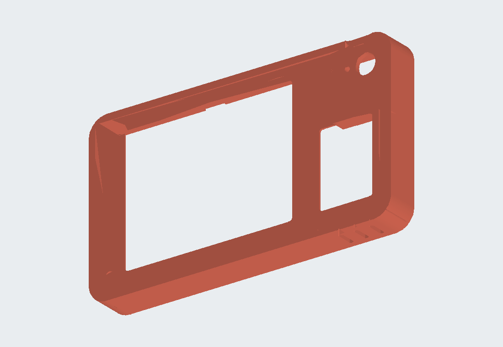

# Headway enclosure - Rev9 (wall) = Rev8 + 4th screw, no slit, no photo columns, stronger ribs

[All five model views](../../README.md#model-a--wall-rev9) · [FreeCAD source](Headway_enclosure_rev9.FCStd) · [STEP export](Headway_enclosure_rev9.step)

Script: `../../freecad/enclosure_rev9.py`. Checked on the model only (not printed yet).
Print **shell + back plate** again (both changed). Key is the same as Rev6-Rev8.

## Changes vs Rev8
- **4th screw (corner boss):** new insert boss in the top-right inside corner (x 112.4, z 59.9), merged into the top and
  right walls. It grows from the front wall, but where it sits behind the photo card it steps back 0.3 mm behind the
  card with 45 deg slopes, so it never touches the card and prints face-down without support.
  Insert pressed in **from the back** (the plate side); screw **M2.5 x 6** countersunk through the back plate,
  3.0 mm thread in the insert. Now the back plate is screwed at 4 corners.
- **Top slit removed** (no more bridge in the top wall). The card now goes in from the inside before the back plate is
  closed and is fixed with a bit of tape/glue. Ledge, right rail and 0.6 mm pocket behind the window stay as locators.
- **Photo columns removed** from the back plate.
- **ESP32 ribs:** another 1 mm off the wall-side end (x 99.6-107.6; wire channel to the plate edge 8.5 mm, was 7.5),
  and stronger: 4.2 mm wide at the plate -> 2.4 mm at the tip (was 3.0 -> 1.8).
- Top vents moved 4 mm left to make room for the boss.

## Print (Bambu A1 mini, PLA, 0.2 mm, no supports)
| File | Orientation | Settings |
|---|---|---|
| `rev9_1_front_shell.stl` | front face down | 3 walls (4 is better around the insert posts), 15 % infill |
| `rev9_2_back_plate.stl` | flat back down | same |
| `rev9_3_boot_key.stl` | face down | same key as Rev6-Rev8 - reuse yours if you have one |
| `rev9_0_optional_fit_test.stl` | face down | front part only, to check the display window before the full shell |

## Hardware (from Saurav's kits)
- 4 x **M2.5 x 3 x 3.5** knurled brass inserts (TexSync kit): 3 in the display posts + 1 in the corner boss
- 3 x **M2.5 x 12** countersunk Phillips screws (display holes) + 1 x **M2.5 x 6** countersunk (corner boss) (AIMUNOK kit)

## Assembly
1. **Inserts:** soldering iron at ~210-220 C, press slowly and straight until flush.
   - The 3 display-post inserts go in from the front side of the posts (bottom-left, top-left and bottom-right corners
     of the display area). There is 1.5 mm of front wall under each, so the front face stays clean.
   - The corner-boss insert goes in from the back (the open side of the shell), flush with the boss top.
2. Key into its hole, Super Mini into its band.
3. **Card:** put it behind the photo window from inside (resting on the ledge, against the right rail) and fix it with
   a bit of tape or glue.
4. Display glass-down onto the 3 insert posts, its holes over the inserts.
5. Back plate on (it sits on the step all round). Screw the 3 M2.5 x 12 in from the back, through the plate, the
   spacer and the display hole into the insert. Before the final turn, nudge the display so the picture is centred in
   the window (the screws have ~0.3 mm play in the display holes), then tighten gently - snug is enough.
   Then the M2.5 x 6 into the top-right corner boss.
6. To open: undo the 4 screws and lift the plate.

## What each screw does
Display screws: back plate countersink -> solid spacer (presses the display board) -> display mounting hole -> brass
insert in the front shell post, so the same 3 screws close the case AND clamp the display. The 4th (corner) screw only
holds the plate's top-right corner.

## Checks (script)
All overlaps 0; corner screw only meets its insert hole; boss vs card 0; key, RESET, display screws unchanged.
