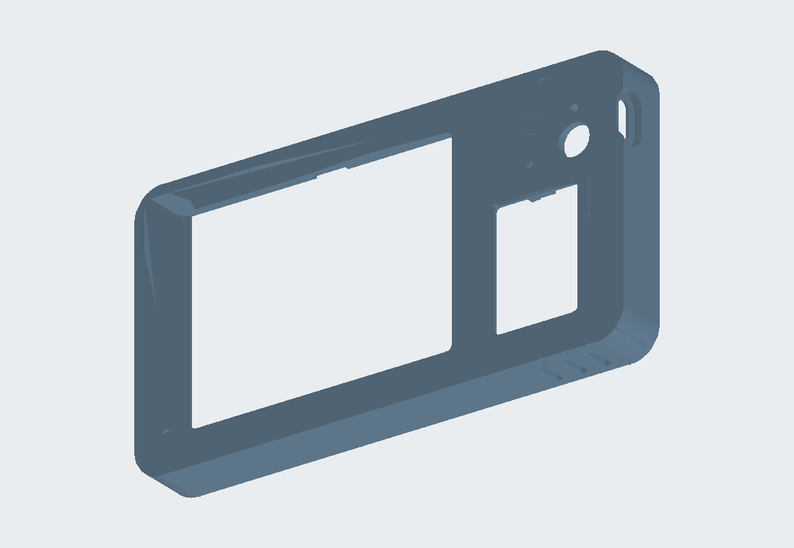
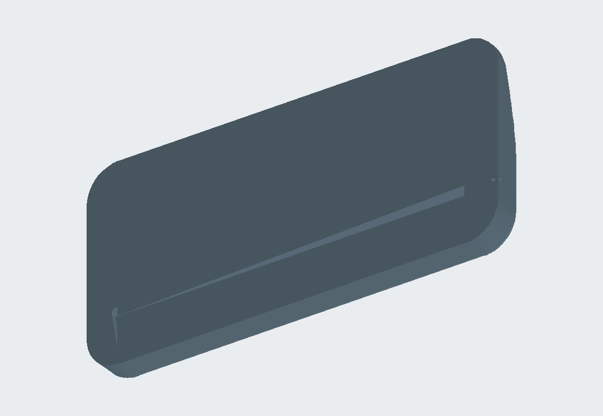

# Model B · desk case, rev2

[Back to both models](../../README.md) · [FreeCAD model](Headway_desk_rev2.FCStd) · [STEP export](Headway_desk_rev2.step)

This version sits in a separate 15° stand with USB-C accessible from the right. It inherits the Rev9 wall case's fourth insert boss, closed top edge and stronger ESP32 ribs. The picture card goes in from inside before the back plate is fitted; there is no top insertion slit in rev2. The stand is unchanged from rev1 and can be reused.

## Parts to print

- `desk_rev2_0_optional_fit_test.stl` — a short front-section test for the display window.
- `desk_rev2_1_front_shell.stl` — front face down; 0.2 mm layer, 3 walls (4 around insert posts), 15% infill.
- `desk_rev2_2_back_plate.stl` — back face down; the same wall and infill settings.
- `desk_rev2_3_boot_key.stl` — face down; the key is reusable from earlier versions.
- `desk_rev2_4_stand.stl` — flat bottom down; 3 walls, 25% infill.

These settings are from the model notes for a Bambu A1 mini and PLA, without supports. A short fit test is sensible before the full shell.

## Hardware and assembly

Use **four M2.5 × 3 × 3.5 mm knurled brass heat-set inserts**, **three M2.5 × 12 mm countersunk screws** for the display posts and **one M2.5 × 6 mm countersunk screw** for the corner boss. Four small adhesive feet under the stand are optional.

1. Press the three display-post inserts in from the front side of the posts and the corner-boss insert in from the back. The model notes suggest a soldering iron around 210–220 °C; press each slowly and straight until flush.
2. Put the BOOT key in its hole. Fit the Super Mini in the right-side band, with USB-C through the right slot, antenna end against the stop and BOOT edge up.
3. Put the picture card behind its window from inside. Rest it on the ledge, align it against the rail and secure with a little tape or glue.
4. Set the display glass-down on the three posts. Fit the back plate and insert the three long screws through its spacers and display holes into the inserts. Adjust the picture in the window before the final gentle turn. Fit the short fourth screw at the corner boss.
5. Lower the case into the stand with the screen toward the low front lip. Plug USB-C in from the right; the case lifts out without removing the stand.

The stand model is 128.5 × 60 × 10 mm and gives a 15° lean. It covers 3.2 mm of the front face and 7.2 mm of the back; the script-level clearance check keeps the screen, key, reset access and USB opening clear. These are CAD checks only. The current parts have not had a complete physical fit and heat check.

 Separate stand, rendered from the FreeCAD STL export.

